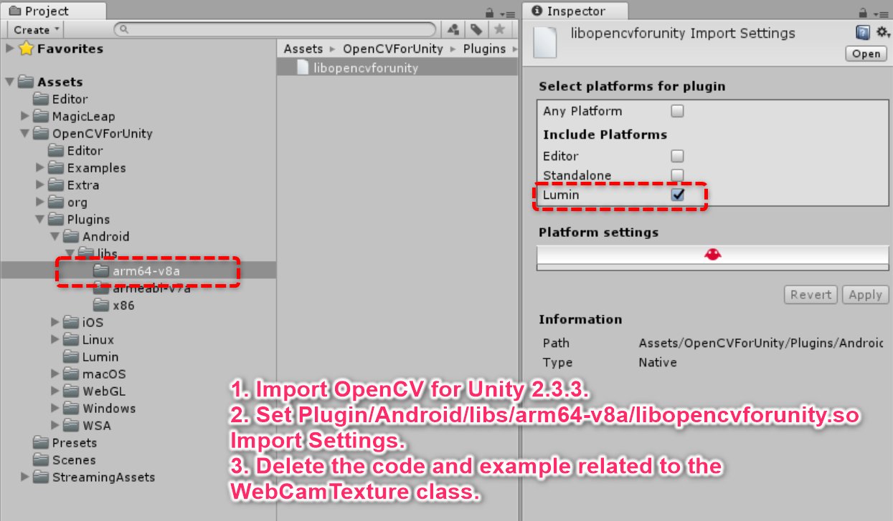
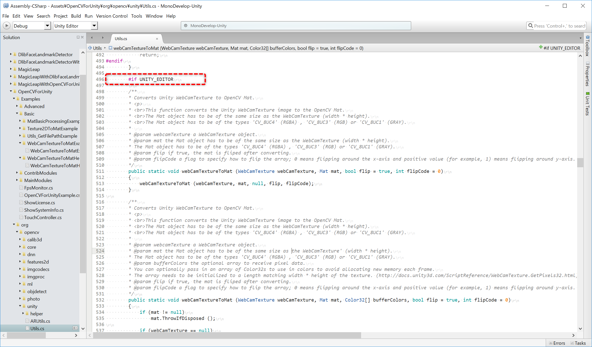
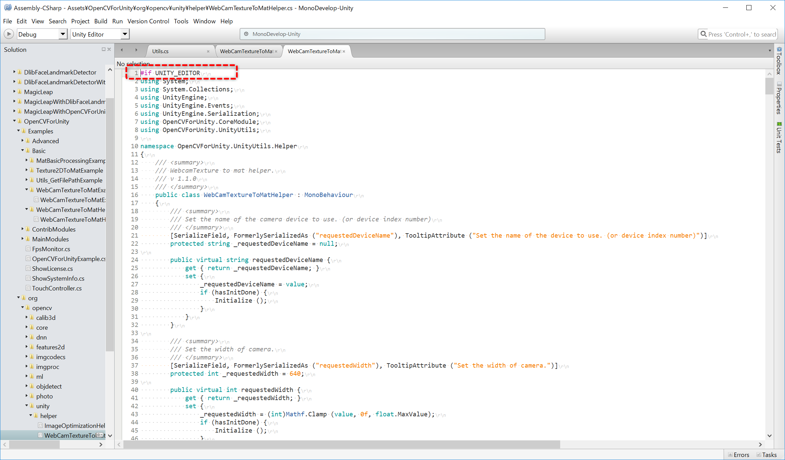
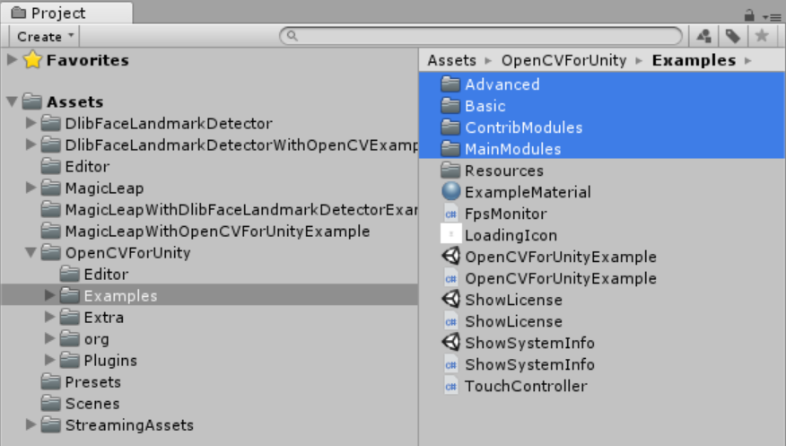

# MagicLeap With OpenCVForUnity Example

## Environment
* MagicLeapOne Lumin OS 0.94
* Unity 2018.1.9f2-MLTP10 (64-bit)  
* [OpenCV for Unity](https://assetstore.unity.com/packages/tools/integration/opencv-for-unity-21088?aid=1011l4ehR) 2.3.3+ 

## Setup
1. Download the latest release unitypackage. [MagicLeapWithOpenCVForUnityExample.unitypackage](https://github.com/EnoxSoftware/MagicLeapWithOpenCVForUnityExample/releases)
1. Create a new project. (MagicLeapWithOpenCVForUnityExample)
1. Import "C:/Users/xxx/MagicLeap/tools/unity/v0.19.0/MagicLeap.unitypackage"
1. Import the OpenCVForUnity.
    * Setup the OpenCVForUnity. (Tools > OpenCV for Unity > Set Plugin Import Settings)
    * Set "Assets/OpenCVForUnity/Plugin/Android/libs/arm64-v8a/libopencvforunity.so" Import Settings.
    
    * Enclose the code related to the WebCamTexture class with #if UNITY_EDITOR and #endif. ( The WebCamTexture class is not included in the MagicLeap API, so an error occurs at build time. )
    
    Assets/OpenCVForUnity/org/opencv/unity/Utils.cs (L496 - L620)
    
    Assets/OpenCVForUnity/org/opencv/unity/helper/WebCamTextureToMatHelper.cs (L1 - L939)
    * Delete "Assets/OpenCVForUnity/Examples" folders.
    
    * Downlod https://raw.githubusercontent.com/pjreddie/darknet/master/cfg/yolov3-tiny.cfg. Copy yolov3-tiny.cfg to "Assets/StreamingAssets/dnn/" folder. Downlod  https://pjreddie.com/media/files/yolov3-tiny.weights. Copy yolov3-tiny.weights to "Assets/StreamingAssets/dnn/" folder. Downlod  https://github.com/pjreddie/darknet/tree/master/data/coco.names. Copy coco.names to "Assets/StreamingAssets/dnn/" folder.     
1. Import the MagicLeapWithOpenCVForUnityExample.unitypackage.
1. Add the "Assets/MagicLeapWithOpenCVForUnityExample/*.unity" files to the "Scenes In Build" list in the "Build Settings" window.
1. Check CameraCapture checkbox in Publishing Settings.
1. Build and Deploy to MagicLeap.

## ScreenShot
 

