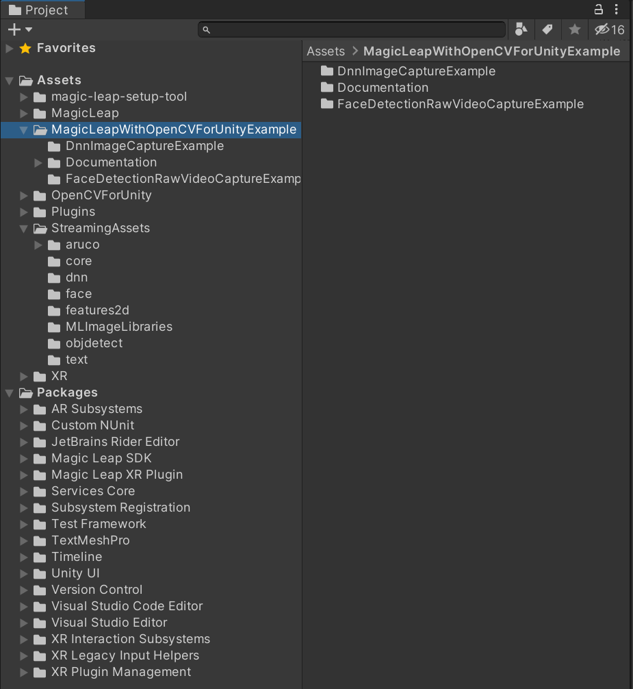
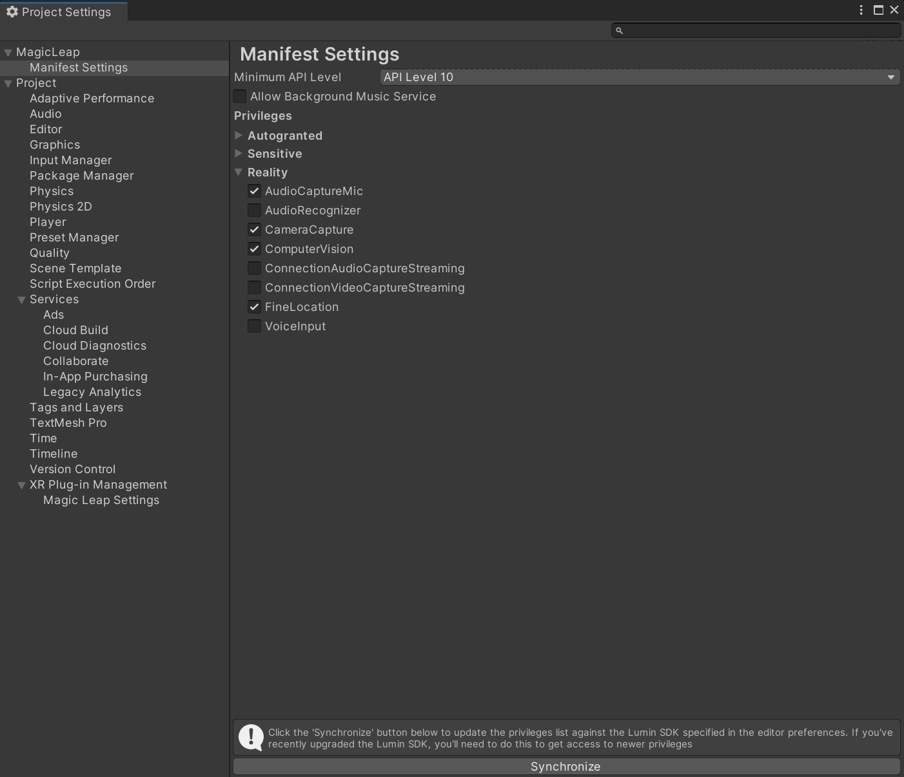
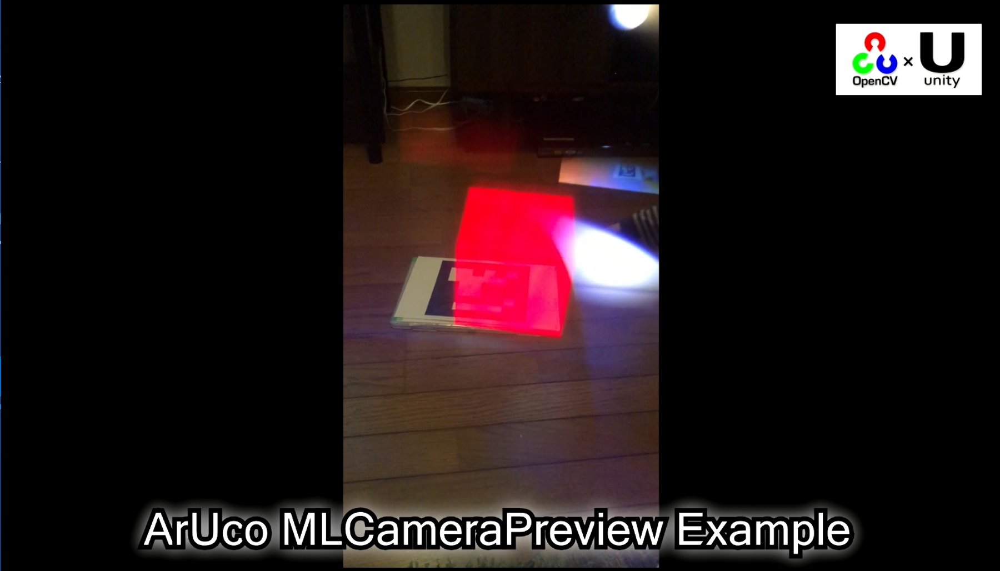

# MagicLeap With OpenCVForUnity Example

## Environment
* MagicLeapOne Lumin OS 0.97
* Unity 2019.2.0b10 (64-bit)  
* [OpenCV for Unity](https://assetstore.unity.com/packages/tools/integration/opencv-for-unity-21088?aid=1011l4ehR) 2.3.5+ 

## Setup
1. Download the latest release unitypackage. [MagicLeapWithOpenCVForUnityExample.unitypackage](https://github.com/EnoxSoftware/MagicLeapWithOpenCVForUnityExample/releases)
1. Create a new project. (MagicLeapWithOpenCVForUnityExample)
1. Import "C:/Users/xxx/MagicLeap/tools/unity/v0.22.0/MagicLeap.unitypackage"
1. Import the OpenCVForUnity.
    * Setup the OpenCVForUnity. (Tools > OpenCV for Unity > Set Plugin Import Settings)
    * Move the "OpenCVForUnity/StreamingAssets/" folder to the "Assets/" folder.
    * Downlod https://raw.githubusercontent.com/pjreddie/darknet/master/cfg/yolov3-tiny.cfg. Copy yolov3-tiny.cfg to "Assets/StreamingAssets/dnn/" folder. Downlod  https://pjreddie.com/media/files/yolov3-tiny.weights. Copy yolov3-tiny.weights to "Assets/StreamingAssets/dnn/" folder. Downlod  https://github.com/pjreddie/darknet/tree/master/data/coco.names. Copy coco.names to "Assets/StreamingAssets/dnn/" folder.     
1. Import the MagicLeapWithOpenCVForUnityExample.unitypackage.
   
1. Add the "Assets/MagicLeapWithOpenCVForUnityExample/*.unity" files to the "Scenes In Build" list in the "Build Settings" window.
1. Check CameraCapture and ComputerVision checkbox in Publishing Settings.
   
1. Build and Deploy to MagicLeap.
    * (Print the AR marker "ArUcoMarker_DICT_6X6_250_ID1.pdf" on an A4 size paper)

## ScreenShot
 

In the current code, the overlap between the holographic object and the actual object is not accurate. The holographic object is shifted to the right for some reason. Pull requests are always welcome.

